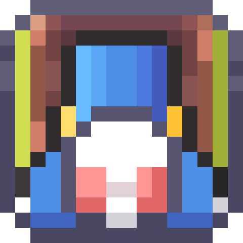
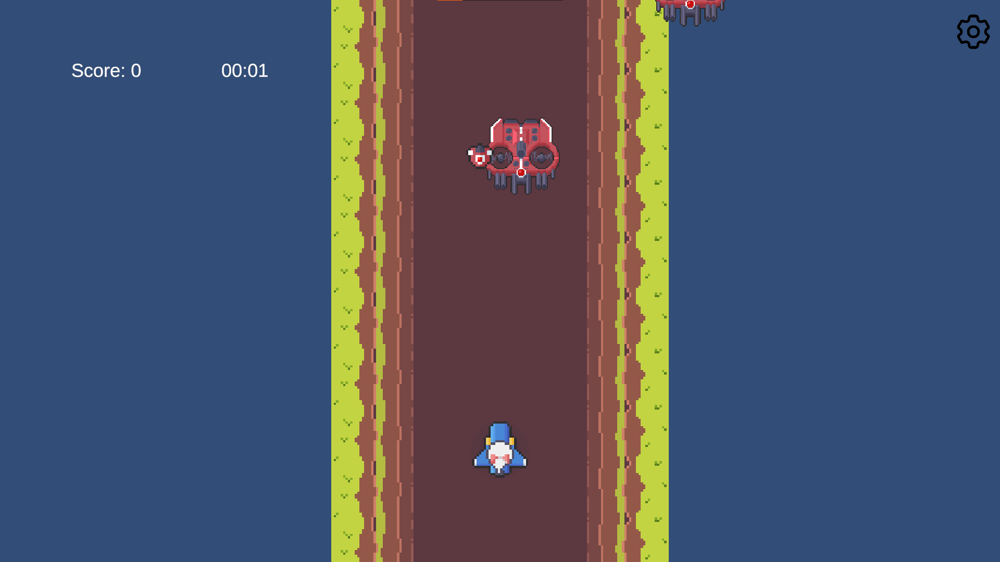
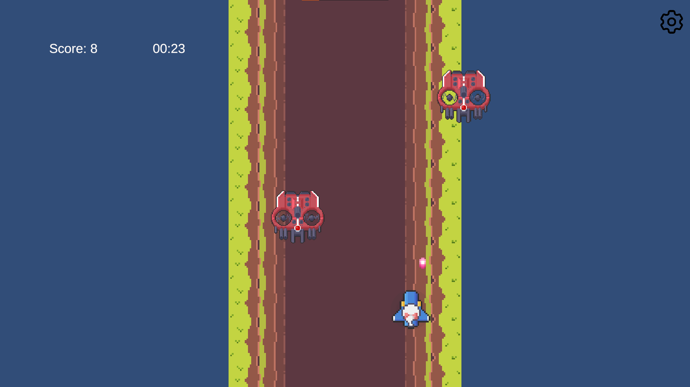
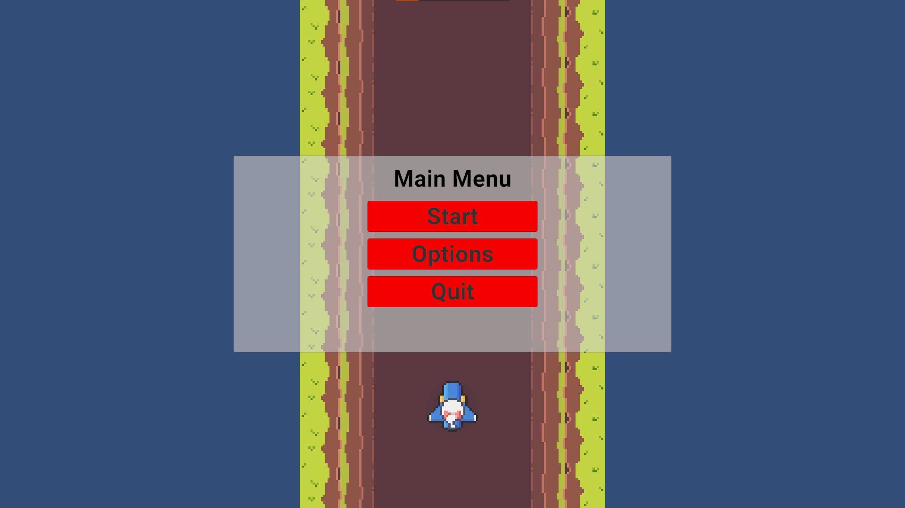
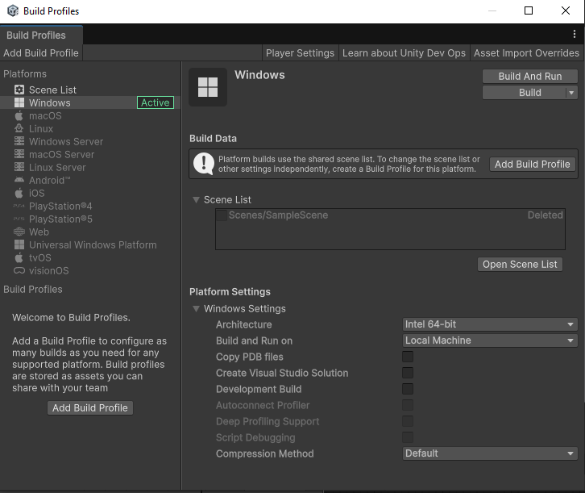

# FireFly - 2D Vertical Shooting Game



## 📖 Giới thiệu

N1909 là một game bắn súng theo chiều dọc 2D được phát triển bằng Unity. Người chơi điều khiển một chiếc tàu vũ trụ để tiêu diệt các kẻ thù xuất hiện từ phía trên màn hình trong không gian vô tận.

## 📸 Screenshots

<div align="center">
  
  
</div>

<div align="center">
  
  <!--  -->
</div>

## 🎮 Gameplay

- **Thể loại**: Vertical Scrolling Shooter (Game bắn súng theo chiều dọc)
- **Điều khiển**: 
  - Di chuyển tàu trái/phải
  - Tự động bắn đạn
- **Mục tiêu**: Tiêu diệt kẻ thù và đạt điểm số cao nhất có thể
- **Cơ chế**: Tránh va chạm với kẻ thù và chướng ngại vật

### 🎯 Demo Gameplay

*Gameplay demo showing player movement, shooting, and enemy interactions*

## 🛠️ Tính năng hiện tại

### ✅ Đã hoàn thành:
- **Hệ thống người chơi**: PlayerController với animation xoay trái/phải
- **Hệ thống bắn đạn**: Bullet system với tần suất bắn có thể điều chỉnh
- **Hệ thống kẻ thù**: Enemy spawning và movement
- **Hệ thống chướng ngại vật**: Obstacle spawning
- **Object Pooling**: Tối ưu hiệu suất cho bullets và enemies
- **Game Manager**: Quản lý trạng thái game và điểm số
- **UI System**: Interface người dùng cơ bản
- **Hệ thống explosion**: Hiệu ứng nổ
- **Main Menu**: Màn hình menu chính

### 🚧 Đang phát triển:
- Cân bằng gameplay
- Thêm power-ups
- Cải thiện hiệu ứng âm thanh
- Thêm levels và boss fights
- Tối ưu hóa performance

## 🏗️ Cấu trúc dự án

```
Assets/
├── Animation/          # Animation clips và controllers
├── Prefabs/           # Game objects prefabs
├── Scenes/            # Unity scenes
│   └── MainMenu.unity # Màn hình menu chính
├── Scripts/           # Source code
│   ├── Bullet.cs      # Logic đạn bắn
│   ├── Enemy.cs       # Logic kẻ thù
│   ├── EnemySpawner.cs # Spawn kẻ thù
│   ├── Explosion.cs   # Hiệu ứng nổ
│   ├── GameManager.cs # Quản lý game
│   ├── ObjectPooler.cs # Object pooling system
│   ├── Obstacle.cs    # Chướng ngại vật
│   ├── ObstacleSpawner.cs # Spawn chướng ngại vật
│   ├── PlayerController.cs # Điều khiển người chơi
│   ├── StartButton.cs # Nút bắt đầu game
│   └── UIManager.cs   # Quản lý giao diện
├── Settings/          # Project settings
├── TextMesh Pro/      # TextMesh Pro assets
├── UI/               # UI elements
└── Vertical 2D Shooting BE4/ # Game assets package
```

## 🎯 Yêu cầu hệ thống

- **Unity Version**: 2022.3 LTS hoặc mới hơn
- **Platform**: Windows, Mac, Linux
- **Target**: Desktop và Mobile (có thể mở rộng)
- **Minimum Requirements**:
  - RAM: 4GB
  - Storage: 500MB
  - DirectX: Version 11

## 🚀 Hướng dẫn chạy dự án

1. **Clone repository**:
   ```bash
   git clone https://github.com/luuconghoangnam/game-FireFly.git
   ```

2. **Mở trong Unity**:
   - Mở Unity Hub
   - Chọn "Open" và navigate đến thư mục dự án
   - Chọn thư mục `N1909`

3. **Chạy game**:
   - Mở scene `MainMenu` trong thư mục `Assets/Scenes/`
   - Nhấn Play button trong Unity Editor

### 📦 Build Game


1. Mở **File > Build Settings**
2. Chọn platform mong muốn
3. Nhấn **Build** để tạo executable file

## 🎮 Điều khiển


| Hành động | Phím |
|-----------|------|
| Di chuyển trái | A hoặc ← |
| Di chuyển phải | D hoặc → |
| Bắn đạn | Tự động |
| Tạm dừng | ESC |

## �️ Công nghệ sử dụng

<p align="center">
   
   
</p>

- **Game Engine**: Unity 2022.3 LTS
- **Programming Language**: C#
- **Version Control**: Git
- **IDE**: Visual Studio / Visual Studio Code
- **Graphics**: 2D Sprites & Animations
- **Audio**: Unity Audio System

## 📊 Tiến độ phát triển

![Development Progress]

| Feature | Status | Progress |
|---------|--------|----------|
| Core Gameplay | ✅ | 100% |
| Player Movement | ✅ | 100% |
| Shooting System | ✅ | 100% |
| Enemy AI | ✅ | 90% |
| UI System | ✅ | 80% |
| Audio System | 🚧 | 30% |
| Power-ups | 🚧 | 20% |
| Boss Battles | ❌ | 0% |

## �📈 Roadmap

### Version 1.0 (Target)
- [ ] Hoàn thiện gameplay cơ bản
- [ ] Thêm âm thanh và nhạc nền
- [ ] Implement power-up system
- [ ] Thêm nhiều loại kẻ thù
- [ ] Boss battles
- [ ] Level progression

### Version 1.1
- [ ] Mobile controls
- [ ] Achievements system
- [ ] Leaderboard
- [ ] Multiple ship types

### Version 2.0
- [ ] Multiplayer support
- [ ] Campaign mode
- [ ] Ship customization

## 🐛 Known Issues

- Performance cần được tối ưu khi có nhiều objects trên màn hình
- Balance gameplay cần điều chỉnh
- UI cần polish thêm

## 🤝 Đóng góp

Dự án hiện đang trong giai đoạn phát triển. Mọi góp ý và đóng góp đều được hoan nghênh!

### 💡 Cách đóng góp:
1. Fork repository
2. Tạo feature branch (`git checkout -b feature/AmazingFeature`)
3. Commit changes (`git commit -m 'Add some AmazingFeature'`)
4. Push to branch (`git push origin feature/AmazingFeature`)
5. Mở Pull Request

### 🐛 Báo cáo lỗi:
- Sử dụng GitHub Issues để báo cáo bugs
- Mô tả chi tiết vấn đề và cách tái tạo
- Đính kèm screenshots nếu có thể

## 📄 License

[Chưa xác định] - Dự án đang trong giai đoạn phát triển

## 📧 Liên hệ

**Developer**: Luu Cong Hoang Nam  
**GitHub**: [@luuconghoangnam](https://github.com/luuconghoangnam)  
**Repository**: [game-FireFly](https://github.com/luuconghoangnam/game-FireFly)

---

<div align="center">
  
  
  **Trạng thái dự án**: 🚧 Đang phát triển
  
  **Cập nhật lần cuối**: Tháng 8, 2025
  
  ⭐ **Nếu bạn thích dự án này, hãy cho một star!** ⭐
</div>
